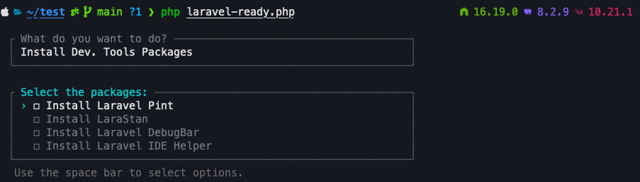
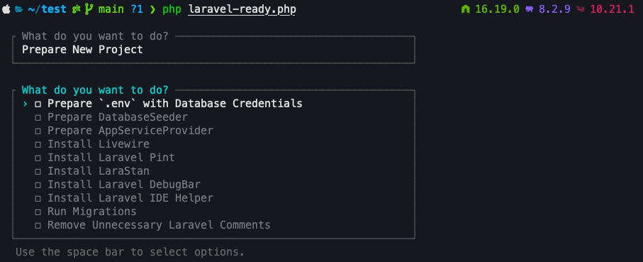

# Laravel Ready

Simple PHP script that can be used to prepare new Laravel projects very easily.

## Preparation

Laravel Ready was made to consume information from a `.laravel` file in 
your user folder. Therefore, the first step to be taken is to create a `.laravel` 
file in the root of your local user:

```bash
touch ~/.laravel
```

After that configure the file with the accepted settings:

```dotenv
DB_CONNECTION=sqlite
DB_HOST=127.0.0.1
DB_PORT=3306
DB_DATABASE=/Users/aj/database/database.sqlite
DB_USERNAME=
DB_PASSWORD=

PINT_PRESET=laravel
```

**You are ready to run the file!** Continue to the below section.

## Usage

1. Download the file by using `wget` in the root of your project:

```bash
wget https://aj.dev.br/laravel-ready.php
```

2. Execute the script:

```bash
php laravel-ready.php
```

## Available Options

### Install Dev. Tools Packages:



When select `Install Laravel Pint`:
- The package will download the [Laravel Pint](https://laravel.com/docs/pint) and configure the `PINT_PRESET` in the `pint.json` file. **You can also configure the preset from one of your Gists. Laravel Ready will take it automatically,** otherwise [use any pre-built Laravel Pint preset](https://laravel.com/docs/10.x/pint#presets).
- A `format` composer script will be created at the `composer.json`, to provide the ability to run the Pint using: `composer format`.

When select `Install LaraStan`:
- The package will download and install the [LaraStan package](https://github.com/nunomaduro/larastan)
- A `analyse` composer script will be created at the `composer.json`, to provide the ability to run the Pint using: `composer analyse`.

When both is selected, a `test` composer scripts will be created to provide the ability to run both using: `composer test`.

### Prepare New Project



This option is self-explanatory. The unique observations here is:

1. `Prepare DatabaseSeeder`:
- Will uncomment the code from the `DatabaseSeeder` class:

```diff
- // \App\Models\User::factory()->create([
- //     'name' => 'Test User',
- //     'email' => 'test@example.com',
- // ]);
+ // \App\Models\User::factory()->create([
+ //     'name' => 'Test User',
+ //     'email' => 'test@example.com',
+ // ]);
```

2. `Prepare AppServiceProvider`:
- Will prepare the `AppServiceProvider` like that:
    
```diff
public function boot(): void
{
-    //
+    auth()->loginUsingId(1);
}
```

3. `Run Migrations`:
- Will run the `php artisan migrate:fresh --seed` - to create the default user that can be used in the `auth()->loginUsingId(1)`.

2. `Remove Unnecessary Laravel Comments`:
- Will loop into all files from `app/` and `database/` to remove all unnecessary Laravel comments. **Only the codes with `//` will be preserved.**

## Additional Information

1. For safety, you can't run this script in production.
2. Livewire V3 installation will automatically remove AlpineJS.
3. The script can generate a [valet link](https://laravel.com/docs/valet) automatically when select `Prepare New Project` - needs Valet installed.
4. Logs can be created in `storage/logs/laravel-ready.log`.